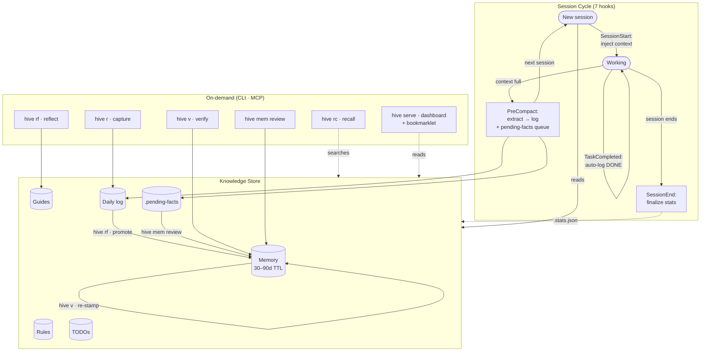

# keephive

<p align="center">
  <a href="https://github.com/joryeugene/keephive/actions/workflows/ci.yml"></a>
  <a href="https://pypi.org/project/keephive/"></a>
  <a href="https://pypi.org/project/keephive/"></a>
  <a href="https://github.com/joryeugene/keephive/releases/latest"></a>
  <a href="https://github.com/joryeugene/keephive/blob/main/LICENSE"></a>
</p>

A knowledge sidecar for Claude Code. It captures what you learn, verifies it stays true, and surfaces it when relevant.

## TLDR

1. **Install**: `curl -fsSL https://raw.githubusercontent.com/joryeugene/keephive/main/install.sh | bash`
2. **Use Claude Code normally.** Seven hooks run automatically: they capture what you learn, inject it next session, and flag when facts go stale.
3. **Look around**: `hive status` (`h s`), `hive log` (`h l`), `hive todo`
4. **Visual overview**: `hive serve` (`h ws`) opens a browser dashboard at localhost:3847
5. **Periodic cleanup**: `hive verify` (`h v`), `hive reflect` (`h rf`), `hive audit` (`h a`)

Everything else on this page is optional depth.

> [!TIP]
> **Shortcuts everywhere.** Three CLI names: `keephive`, `hive`, `h`. Every command
> has a short alias (`h s`, `h r`, `h rc`, `h v`, `h rf`, `h a`). Guides and
> prompts resolve by slug, prefix, or substring:
> ```
> h p pr-re        →  pr-review-git-staged-diff-analysis.md
> h k agent        →  agent-principles.md
> h n code-review  →  starts note from code-review prompt template
> h go pr-re       →  launches session with pr-review prompt loaded
> ```
> You never type a full name. Two keystrokes for the command, a few more for the target.

<p align="center">
  
  
</p>

Claude Code forgets everything between sessions. keephive rides alongside it using hooks, an MCP server, and context injection to give it persistent, verified memory.

<p align="center">
  
</p>

After a few sessions, `hive` shows what your agent has learned:

<p align="center">
  
</p>

<details>
<summary>Text output</summary>

```console
$ hive
keephive v0.15.0
  ● hooks  ● mcp  ● data

  4 facts (4 ok) | 12 today | 8 yesterday | 2 guides | 48K
  42 cmds today · 120 this week · 5d streak ▁▂▅▃█▇▂▁▁▃▅▆▇█▂▁▁▁▁▁▁▁▁

  1 open TODO(s):
    [today] Add rate limiting to the /upload endpoint.

  Today:
  ~ [10:42:15] FACT: Auth service uses JWT with RS256, tokens expire after 1h.
  ~ [10:38:01] DECISION: Chose Postgres over SQLite for multi-user support.
  ~ [09:15:44] INSIGHT: The retry logic in api_client.py silently swallows 429s.
  [09:12:30] DONE: Migrate user table to new schema.

  Active draft: slot 1 · "api testing todo list..." (47 words)  ->  hive nc

  hive go (session) | hive l (log) | hive rf (reflect) | hive help
```

</details>

---

## Install

```bash
curl -fsSL https://raw.githubusercontent.com/joryeugene/keephive/main/install.sh | bash
```

One command. Installs keephive, registers 7 hooks and an MCP server, and verifies everything. Requires [uv](https://docs.astral.sh/uv/). Run once; re-run after upgrades.

Or install manually:

```bash
uv tool install keephive
keephive setup
```

Via pip:

```bash
pip install keephive
keephive setup
```

From source:

```bash
git clone https://github.com/joryeugene/keephive.git
cd keephive && uv tool install . && keephive setup
```

### Stay up to date

```bash
hive up                    # upgrade in place (recommended)
uv tool upgrade keephive   # manual alternative; run keephive setup after
```

> [!TIP]
> Run `keephive setup` again after upgrading manually to sync hooks and the MCP server registration to the new binary path.

---

## When to use what

### Every day (bread and butter)

| I want to...                       | Command                                    |
| ---------------------------------- | ------------------------------------------ |
| See what's going on                | `hive status` *(hive s)*                   |
| Save something I learned           | `hive remember "FACT: ..."` *(hive r)*     |
| Find something from before         | `hive recall <query>` *(hive rc)*          |
| Track a task                       | `hive todo "fix auth"` *(hive t)*          |
| Mark a task done                   | `hive todo done "auth"` *(hive td)*        |
| See today's log                    | `hive log` *(hive l)*                      |

### Visual overview

| I want to...                       | Command                                    |
| ---------------------------------- | ------------------------------------------ |
| Browse everything in a browser     | `hive serve`                               |
| Quick terminal glance              | `hive status` *(hive s)*                   |
| Watch for changes live             | `hive status --watch`                      |
| See active sessions                | `hive ps`                                  |

### Weekly maintenance (when things accumulate)

| I want to...                       | Command                                    |
| ---------------------------------- | ------------------------------------------ |
| Check if old facts are still true  | `hive verify` *(hive v)*                   |
| Find patterns in daily logs        | `hive reflect` *(hive rf)*                 |
| Get a quality assessment           | `hive audit` *(hive a)*                    |
| Archive old logs                   | `hive gc`                                  |

### Power features (when you need them)

| I want to...                       | Command                                    |
| ---------------------------------- | ------------------------------------------ |
| Launch a focused session           | `hive session` *(hive go)*                 |
| Run a session with a custom prompt | `hive go <prompt>` *(prefix match)*        |
| Edit memory/rules/todos directly   | `hive edit <target>` *(hive e)*            |
| Use a multi-slot scratchpad        | `hive note` *(hive n)*                     |
| Create a knowledge guide           | `hive knowledge edit <name>` *(hive ke)*   |
| Generate a standup                 | `hive standup` *(hive su)*                 |

---

## How it works

keephive uses the three extension points Claude Code exposes:

1. **Hooks** fire on events (session start, conversation compact, user prompt). They capture insights and inject context without any agent action.
2. **MCP server** gives Claude Code native tool access (`hive_remember`, `hive_recall`, etc.) so the agent can read and write memory directly.
3. **Context injection** surfaces verified facts, behavioral rules, stale warnings, matching knowledge guides, open TODOs, and cross-project activity hints at the start of every session via the SessionStart hook's `additionalContext` field.

### The loop

```
  capture --> recall --> verify --> correct
     ^                                 |
     +---------------------------------+
```

- **Capture**: The PreCompact hook extracts FACT/DECISION/TODO/INSIGHT entries when conversations compact. It reads the full transcript, classifies insights via LLM, and writes them to today's daily log.
- **Recall**: Captured entries surface automatically at the next session start via context injection. `hive rc` searches all tiers directly; `hive` shows current state.
- **Verify**: Facts carry `[verified:YYYY-MM-DD]` timestamps. After 30 days (configurable), they are flagged stale. `hive v` checks them against the codebase with LLM analysis and tool access.
- **Correct**: Invalid facts get replaced with corrected versions. Valid facts get re-stamped. Uncertain facts get flagged for human review.

### Architecture



### Memory tiers

| Tier             | Path                                 | Purpose                           |
| ---------------- | ------------------------------------ | --------------------------------- |
| Working memory   | `~/.claude/hive/working/memory.md`   | Core facts, loaded every session  |
| Rules            | `~/.claude/hive/working/rules.md`    | Behavioral rules for the agent    |
| Knowledge guides | `~/.claude/hive/knowledge/guides/`   | Deep reference on specific topics |
| Daily logs       | `~/.claude/hive/daily/YYYY-MM-DD.md` | Append-only session logs          |
| Archive          | `~/.claude/hive/archive/`            | Old daily logs after gc           |

### Hooks

| Hook             | Trigger               | What it does                                           |
| ---------------- | --------------------- | ------------------------------------------------------ |
| SessionStart     | New session           | Injects memory, rules, TODOs, stale warnings           |
| PreCompact       | Conversation compacts | Extracts insights from transcript, writes to daily log with project attribution |
| PostToolUse      | After Edit/Write      | Periodic nudge to record decisions                     |
| UserPromptSubmit | User sends prompt     | Periodic nudge, UI queue injection                     |
| Stop             | Agent turn ends       | Increments turn counter, periodic micro-nudge          |
| SessionEnd       | Session terminates    | Finalizes session stats with accurate end timestamp    |
| TaskCompleted    | Task marked done      | Auto-logs DONE entry to daily log                      |

---

## Commands

<details>
<summary><b>Full command reference</b> (35 commands)</summary>

| Command                 | Short             | What                                       |
| ----------------------- | ----------------- | ------------------------------------------ |
| **Capture**             |                   |                                            |
| `hive remember "text"`  | `hive r "text"`   | Save to daily log                          |
| `hive t <text>`         |                   | Quick-add a TODO                           |
| `hive note`             | `hive n`          | Multi-slot scratchpad ($EDITOR)            |
| `hive n todo`           | `hive 4 todo`     | Extract action items from a note slot      |
| **Recall**              |                   |                                            |
| `hive status`           | `hive` / `hive s` | Status overview                            |
| `hive recall <query>`   | `hive rc <query>` | Search all tiers                           |
| `hive log [date]`       | `hive l`          | View daily log; `hive l summarize` for LLM summary |
| `hive todo`             | `hive td`         | Open TODOs with ages                       |
| `hive todo done <pat>`  |                   | Mark TODO complete                         |
| `hive knowledge`        | `hive k`          | List/view knowledge guides                 |
| `hive prompt`           | `hive p`          | List/use prompt templates                  |
| `hive ps`               |                   | Active sessions, project activity, git state |
| `hive session [mode]`   | `hive go`         | Launch interactive session                 |
| `hive standup`          | `hive su`         | Standup summary with GitHub PR integration |
| `hive stats`            | `hive st`         | Usage statistics                           |
| **Verify**              |                   |                                            |
| `hive verify`           | `hive v`          | Check stale facts against codebase; auto-corrects |
| `hive reflect`          | `hive rf`         | Pattern scan across daily logs             |
| `hive audit`            | `hive a`          | Quality Pulse: 3 perspectives + synthesis  |
| **Manage**              |                   |                                            |
| `hive mem [rm] <text>`  | `hive m`          | Add/remove working memory facts            |
| `hive rule [rm] <text>` |                   | Add/remove behavioral rules                |
| `hive rule learn`       |                   | Learn rules from /insights friction data   |
| `hive rule review`      |                   | Accept/reject pending rule suggestions     |
| `hive edit <target>`    | `hive e`          | Edit memory, rules, todos, etc.            |
| `hive skill`            | `hive sk`         | Manage skill plugins                       |
| **Maintain**            |                   |                                            |
| `hive doctor`           | `hive dr`         | Health check                               |
| `hive gc`               | `hive g`          | Archive old logs                           |
| `hive setup`            |                   | Register hooks and MCP server              |
| `hive update`           | `hive up`         | Upgrade keephive in-place                  |
| **Dashboard**           |                   |                                            |
| `hive serve [port]`     | `hive ws`         | Live web dashboard (localhost:3847)        |
| `hive ui`               |                   | Show / manage UI feedback queue            |

</details>

<details>
<summary><b>Features in depth</b></summary>

#### Dashboard

`hive serve` launches a live web dashboard at localhost:3847 with 8 views:

| View   | Path      | Focus                                              |
| ------ | --------- | -------------------------------------------------- |
| All    | `/`       | Everything: status, log, TODOs, knowledge, memory, notes |
| Daily  | `/daily`  | Active session: log with date nav, TODOs+recurring, standup |
| Dev    | `/dev`    | Quick reference: TODOs+log, facts, knowledge+memory compact |
| Simple | `/simple` | Minimal: status, log, TODOs                        |
| Stats  | `/stats`  | Usage: sparkline, heatmap, streak, command breakdown |
| Know   | `/know`   | Knowledge guides with markdown rendering            |
| Mem    | `/mem`    | Working memory + rules                              |
| Notes  | `/notes`  | Multi-slot scratchpad with switcher                 |

Auto-refresh (configurable interval), Cmd+K search, split-pane resizing, CRUD forms (remember, add TODO, mark done, append note), log type filters, and zero external dependencies.

<p align="center">
  
</p>
<p align="center">
  
</p>

**UI feedback loop**: `hive ui-install` generates a bookmarklet and copies it to your clipboard. Paste it as a bookmark URL, then click it on any page to capture an element selector and a note. The feedback is POSTed to the dashboard server, queued in `.ui-queue`, and automatically injected into your next Claude Code prompt via the UserPromptSubmit hook. No copy-paste required.

#### Log Summarize

`hive l summarize` pipes today's log entries to claude-haiku and prints 3-5 bullet-point highlights. Useful after long sessions before compaction.

#### Smart Recall

`hive rc <query>` uses an SQLite FTS5 index over all daily logs and the archive for ranked full-text search. Run `hive gc` to rebuild the index. Falls back to grep if the index is absent.

#### Guide front matter

Knowledge guides support optional YAML front matter for controlling injection:

| Field | Effect |
|-------|--------|
| `tags: [tag1, tag2]` | Matched against project name for auto-injection |
| `projects: [proj1]` | Matched against project name for auto-injection |
| `paths: ["/path/pattern"]` | Matched against working directory for auto-injection |
| `always: true` | Injected into every session regardless of project (opt-in, no guides ship with this) |

Guides without front matter match only by filename (project name as substring). The `always: true` flag is strictly opt-in and costs one of the three guide slots per session, so use it only for guides that genuinely apply to every project.

#### Notes

`hive n` is a multi-slot scratchpad. Each slot persists across sessions, auto-copies to clipboard on save, and can be initialized from a prompt template (`hive n <template>`). Use `hive n.2` or `hive 2` to switch to slot 2 and open it in `$EDITOR`.

`hive n todo` (or `hive 4 todo` for slot 4) scans the active slot for action items. Both plain text lines and bullet points from a `## todo` section become candidates; items over 120 characters are skipped as observations. For a single item, you get a yes/no prompt. For multiple items, your `$EDITOR` opens with the candidates — delete lines you don't want, save and quit to confirm.

`hive 4 "text"` appends text directly to slot 4 without opening an editor. Use bare-digit commands with a quoted string to capture quick notes mid-session.

#### Edit

`hive e <target>` opens files in `$EDITOR`. Targets: memory, rules, todo (with diff-on-save), CLAUDE.md, settings, daily log, notes. Run `hive e` with no arguments to see all targets.

#### Sessions

`hive go` launches an interactive Claude session with your full keephive context pre-loaded (memory, rules, TODOs, stale warnings, matching guides). The SessionStart hook detects the launch and skips re-injection to avoid duplication.

| Command                 | What                                           |
| ----------------------- | ---------------------------------------------- |
| `hive go`               | General session with full memory and warnings  |
| `hive session todo`     | Walk through open TODOs one by one             |
| `hive session verify`   | Check stale facts against the codebase         |
| `hive session learn`    | Active recall quiz on recent decisions         |
| `hive session reflect`  | Pattern discovery from daily logs              |
| `hive session <prompt>` | Load a custom prompt from `knowledge/prompts/` |

Custom prompts resolve by prefix, so `hive go pr-re` finds `pr-review-git-staged-diff-analysis.md`. You can also pipe content in: `cat api-spec.yaml | hive go review`. Pass `-c` to continue the last conversation or `-r <id>` to resume a specific session.

#### Reflect

`hive rf` scans daily logs for recurring patterns across multiple days. When it finds a theme, `hive rf draft <topic>` generates a knowledge guide from the matching entries. This is how scattered daily notes become structured reference material.

#### Audit

`hive a` runs three parallel LLM analyses on your memory state (fact accuracy, data hygiene, strategic gaps), then synthesizes them into a quality score with actionable suggestions.

#### Standup

`hive su` generates a standup summary from recent daily log activity and optionally includes GitHub PR data.

#### Stats

`hive st` shows usage statistics with per-project breakdown, session streaks, and activity sparklines. The dashboard stats view (`/stats`) adds a 14-day sparkline with day-of-week labels and weekend shading, an hourly heatmap, and a sortable command breakdown table.

#### Prompts

`hive p` lists reusable prompt templates stored in `knowledge/prompts/`. Use them to start notes (`hive n <template>`) or launch custom sessions (`hive session <template>`).

</details>

<details>
<summary><b>MCP tools</b></summary>

All commands are also available as MCP tools for Claude Code to call directly:

`hive_remember`, `hive_recall`, `hive_status`, `hive_todo`, `hive_todo_done`, `hive_knowledge`, `hive_knowledge_write`, `hive_prompt`, `hive_prompt_write`, `hive_mem`, `hive_rule`, `hive_log`, `hive_audit`, `hive_recurring`, `hive_stats`, `hive_fts_search`, `hive_standup`, `hive_ps`

</details>

---

## Configuration

<details>
<summary><b>Environment variables</b></summary>

| Variable              | Default          | Description                            |
| --------------------- | ---------------- | -------------------------------------- |
| `HIVE_HOME`           | `~/.claude/hive` | Data directory                         |
| `HIVE_STALE_DAYS`     | `30`             | Days before a fact is flagged stale    |
| `HIVE_CAPTURE_BUDGET` | `4000`           | Characters to extract from transcripts |
| `ANTHROPIC_API_KEY`   | (unset)          | Enables LLM features inside Claude Code sessions. Never needed from a terminal. |
| `NO_COLOR`            | (unset)          | Disable terminal colors                |

</details>

---

## LLM features

> [!IMPORTANT]
> keephive calls `claude -p` for LLM features. If you're on a Claude Pro or Max subscription, these calls are included at no extra cost (they count against your plan's normal usage limits). If you use Claude Code with API billing, `claude -p` calls consume your API tokens. `ANTHROPIC_API_KEY` is never checked from a terminal or a hook.

The API path exists for one specific case: running LLM commands (`hive a`, `hive v`, etc.) _inside_ a Claude Code session rather than from a separate terminal. That is the only time `ANTHROPIC_API_KEY` is consulted.

<details>
<summary><b>Billing tiers and LLM-powered commands</b></summary>

### Two tiers

| Tier | When active | Cost |
|------|-------------|------|
| `claude -p` subprocess | Terminal or hooks (default, always) | Included with Pro/Max (counts against usage limits); consumes API tokens if on API billing |
| Direct Anthropic API | Inside Claude Code + `ANTHROPIC_API_KEY` set | Paid — per-token API billing |

Hooks (PreCompact, etc.) run without the `CLAUDECODE` environment variable, so they always take the `claude -p` subprocess path regardless of whether `ANTHROPIC_API_KEY` is present in your shell.

### LLM-powered commands

| Command | Model | When to use |
|---------|-------|-------------|
| `hive a` (audit) | 3× haiku + 1× sonnet | Intentional quality check |
| `hive v` (verify) | sonnet + tools, multi-turn | Validating stale facts |
| `hive rf analyze/draft` | haiku | Pattern discovery |
| `hive su` (standup) | haiku | Daily standup generation |
| `hive l summarize` | haiku | End-of-session summary |
| `hive dr` (doctor) | haiku, optional | Duplicate TODO detection |
| PreCompact hook | haiku | Automatic on compaction |

`hive a` and `hive v` are the heavyweight operations. Use them intentionally.

### Free commands (no LLM)

`hive r`, `hive rc`, `hive s`, `hive todo`, `hive t`, `hive m`, `hive rule`, `hive e`, `hive n`, `hive k`, `hive p`, `hive st`, `hive l` (without `summarize`), `hive gc`, `hive sk`, and all hooks except PreCompact (SessionStart, PostToolUse, UserPromptSubmit, Stop, SessionEnd, TaskCompleted).

### Disable automatic LLM calls

> [!NOTE]
> Set `HIVE_SKIP_LLM=1` to skip the PreCompact hook's extraction step. SessionStart never calls an LLM.

</details>

---

## Development

```bash
uv run pytest                          # all tests
uv run pytest -m llm -v -o "addopts="  # LLM E2E tests (slow, real API calls)
uv run pytest -x                       # stop on first failure
```

See [CLAUDE.md](CLAUDE.md) for architecture details.

## License

MIT
